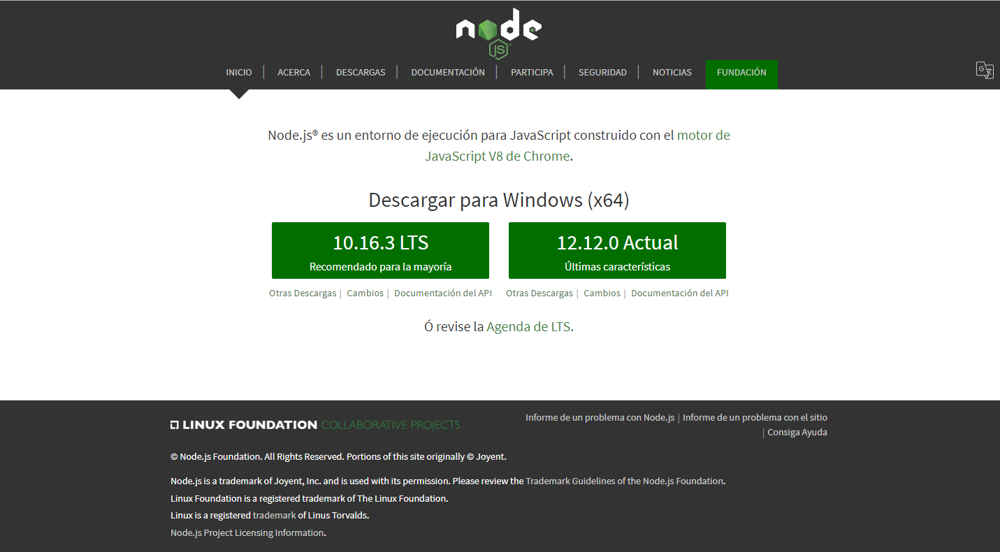
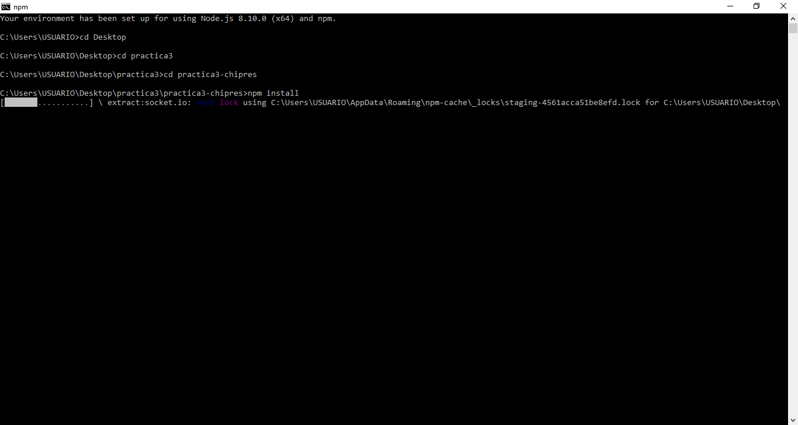
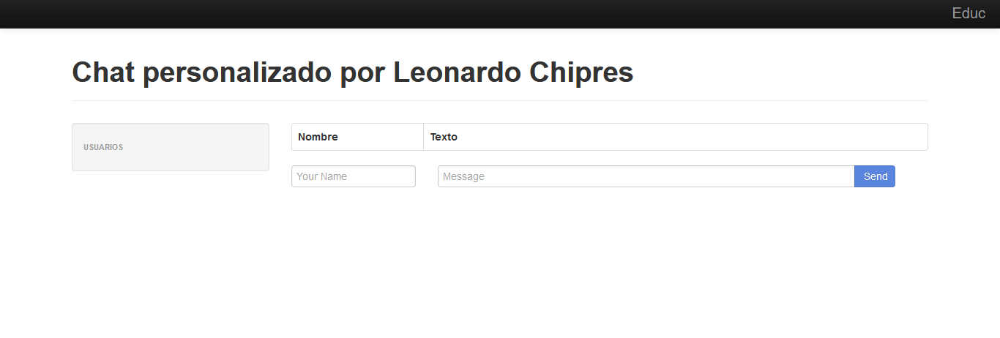

# Proyecto de chat básico
######Proyecto básico de prueba
------
###Introducción
Este proyecto esta realizado con javascript y html las instrucciones siguientes son para configurar el entorno y poder correr la aplicación.

###Instalacion de git
Dirigirse a la pagina web para su descarga [aqui **windows**](https://git-scm.com/download/win)

1. Una vez instalado github abriremos gitbash y clonaremos este proyecto de github.
2. Utiliza *cd para navegar entre carpetas y posicionarte donde clonaras el proyecto.
3. Usa el siguiente comando:

        git clone https://github.com/lchipres/practica3-chipres
4. Asi habras descargado una copia del proyecto.

###Instalacion de Node.js

Dirigirse a la pagina web para su descarga [aqui](https://nodejs.org/es/)
 

1. Una vez instalado abre Node.js Commandprompt.
2. Posicionate sobre tu copia del proyecto.
3. Ejecuta el siguiente comando:
>**npm install**
>>Se descargaran las dependencias necesarias para correr el proyecto.
 
4. Una vez descargadas las dependencias ejecuta el siguiente comando:
>npm start
 